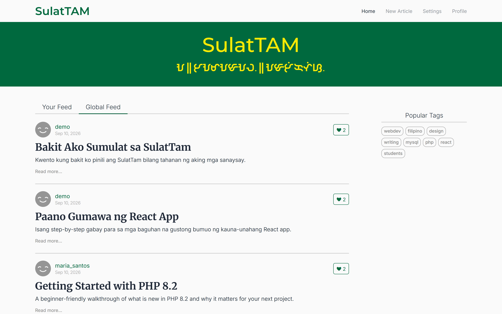
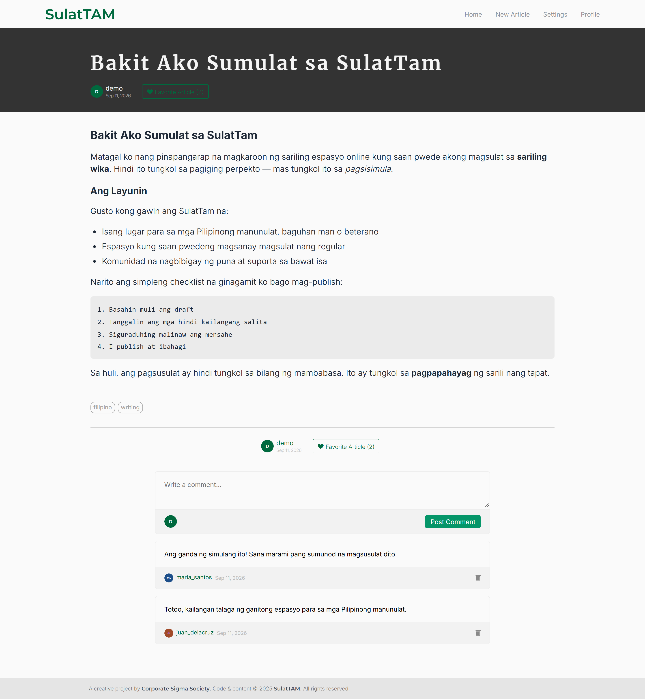
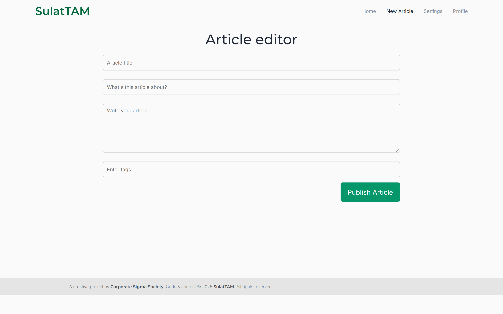
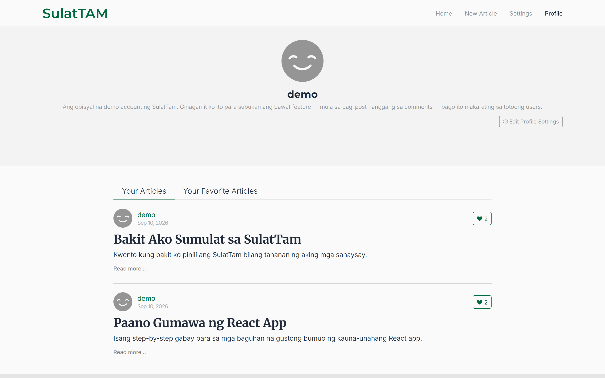
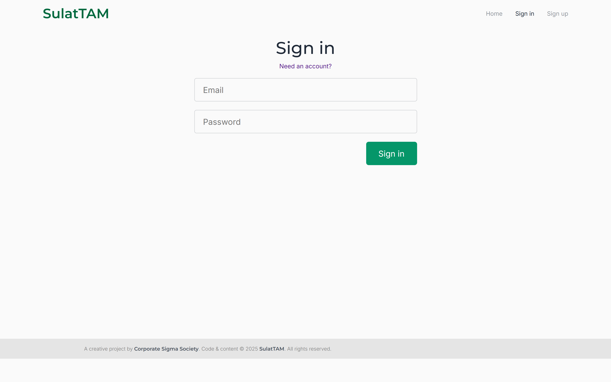

# SulatTam

A full-stack blogging platform for Filipino-language writers — *sulat* is
Filipino for "write". A React 19 SPA talks over JSON to a plain-PHP API
backed by MySQL; the homepage hero's tagline is set in a Baybayin-inspired
display typeface (Malibata).


[](https://github.com/KaeL-0/SulatTam/actions/workflows/ci.yml)

## Screenshots



| | |
|---|---|
|  |  |
|  |  |

*Screenshots show seeded demo data.*

## About the deployment

The original hosting lapsed after its free trial ended. Instead of patching
together a new host, this repo ships a full Docker Compose stack — web app,
API, database, and a mail catcher — that runs the complete application
locally with one command.

## Features

- JWT authentication in an httpOnly cookie
- Email verification on sign-up (MailHog catches the link in development)
- Markdown authoring and rendering — headings, bold/italic, lists, code blocks
- Tags with a popular-tags sidebar
- Favorites
- Follows with a personalized "Your Feed" tab
- Comments on articles
- Public user profiles
- Pagination on every article list
- Admin panel for reviewing submitted articles

## Tech stack

| Layer | Technology | Why |
|---|---|---|
| Frontend | React 19 + TypeScript 5.8, built with Vite 6 | Type-checked SPA with a fast dev server, hot-reloaded through a Docker volume mount |
| Routing | React Router 7 | Client-side routes plus guard components (`RequireAuth`, `RedirectIfAuth`) |
| Styling | SCSS modules | Component-scoped styles with shared color/font variables |
| Markdown | react-markdown | Renders article bodies authored in Markdown |
| Backend | PHP 8.2 on Apache, no framework | One standalone file per endpoint keeps the surface area small and easy to trace |
| Auth | `firebase/php-jwt` (HS256) in an httpOnly cookie | Stateless auth that keeps the token out of reach of JavaScript |
| Mail | PHPMailer + MailHog (dev) | Sends verification emails without needing a real SMTP account locally |
| Database | MySQL 8 via `mysqli`, prepared statements throughout | Relational data — users, articles, tags, follows, comments — safe from injection |
| Image uploads | ImgBB API (optional) | Hosts profile pictures externally; the app degrades gracefully without a key |
| CI | GitHub Actions | Type-checks and lints the frontend, syntax-checks the backend, on every push/PR |
| Local dev | Docker Compose | One command boots the web app, API, database, and MailHog together |

## Quick start

```bash
git clone https://github.com/KaeL-0/SulatTam.git
cd SulatTam
docker compose up
```

| Service | URL |
|---|---|
| Web app | http://localhost:5173 |
| API | http://localhost:8080 |
| MailHog (catches verification emails) | http://localhost:8025 |
| MySQL (for a GUI client) | localhost:3307 |

**Demo login:** `demo@sulattam.local` / `DemoPass123!`

Registering a new account sends a verification email — open MailHog to click
the link.

## Project structure

```
SulatTam/
├── frontend/              # React 19 + TypeScript SPA (Vite)
│   └── src/
│       ├── pages/         # Route-level views (Homepage, ArticlePage, Profile, ...)
│       ├── components/    # Reusable UI (Navbar, ArticleCard, CommentSection, ...)
│       ├── context/       # Six providers holding all server-derived state
│       ├── utilities/     # API base URL, pagination, feed helpers
│       └── css/           # SCSS modules, shared variables, fonts
├── backend/               # PHP 8.2 API — one file per endpoint, no framework
│   ├── auths/             # register, login, logout, verify
│   ├── gets/              # read endpoints (articles, tags, feed, favorites, ...)
│   ├── posts/             # create_article, comment
│   ├── updates/           # favorites, follows, user_info
│   ├── admin/             # session-gated moderation panel
│   └── config/            # env loader plus JWT/cookie configuration
├── database/              # schema.sql (9 tables) and seed.sql (demo data)
├── docs/                  # ARCHITECTURE.md, API.md, screenshots/
├── scripts/               # dev tooling (auth verification, screenshot capture) — not needed to run the app
├── .github/workflows/     # CI: frontend type-check/lint, backend syntax check
├── docker-compose.yml     # web + api + db + mailhog stack
└── .env.example           # documented environment variables
```

The `scripts/` tooling drives a real browser via Playwright. It isn't needed
to run the app, but if you do use it, run `npx playwright install chromium`
once first — `scripts/verify-auth.mjs` will remind you with this exact
command if you skip it.

## Configuration

All runtime configuration is environment-driven — see
[`.env.example`](.env.example) for the full list: database credentials,
`JWT_SECRET`, cookie flags, SMTP settings, `APP_URL`, `ALLOWED_ORIGINS`, and
the optional `IMGBB_API_KEY` for profile-picture uploads.

`docker compose up` needs none of this filled in. `docker-compose.yml`
supplies development values for every variable directly through its
`environment:` entries, and the backend's `.env` loader never overwrites a
variable the real environment already provides. Copy `.env.example` to
`backend/.env`, and `frontend/.env.example` to `frontend/.env` — and change
`JWT_SECRET` in particular — only if you're running outside Docker or
deploying for real.

## Architecture

SulatTam is a React SPA talking to a plain-PHP API — 28 standalone
endpoints, no framework — backed by MySQL 8, with MailHog standing in for a
real SMTP provider in development. Every protected endpoint decodes a JWT
from an httpOnly cookie set at login, and every query carrying user input
runs through `mysqli` prepared statements. Two quirks are worth knowing:
four `public_*` endpoints require the auth cookie despite their names, and
the admin `pending_articles` moderation queue is fully implemented but no
endpoint currently writes to it, so it stays empty. Full request/response
traces, sequence diagrams, and the data model live in
[`docs/ARCHITECTURE.md`](docs/ARCHITECTURE.md); all 28 endpoints are
catalogued in [`docs/API.md`](docs/API.md).

## License

MIT — see [`LICENSE`](LICENSE).
