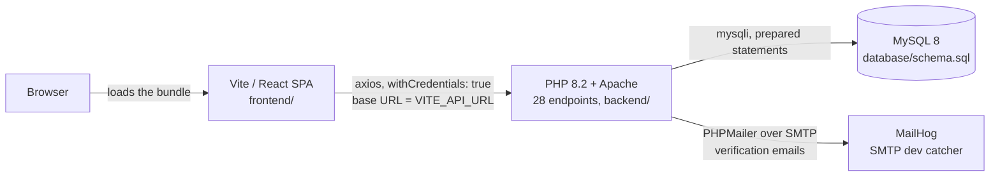
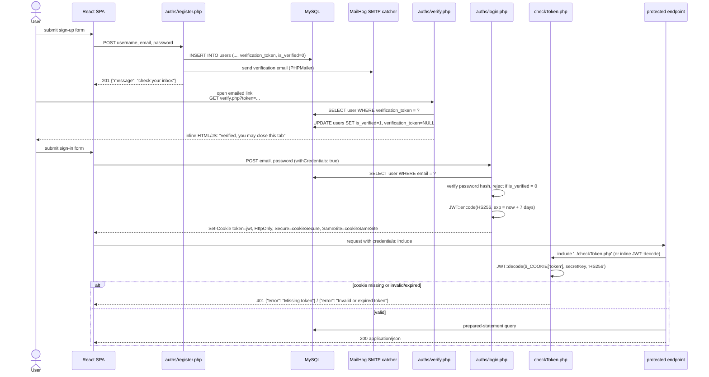
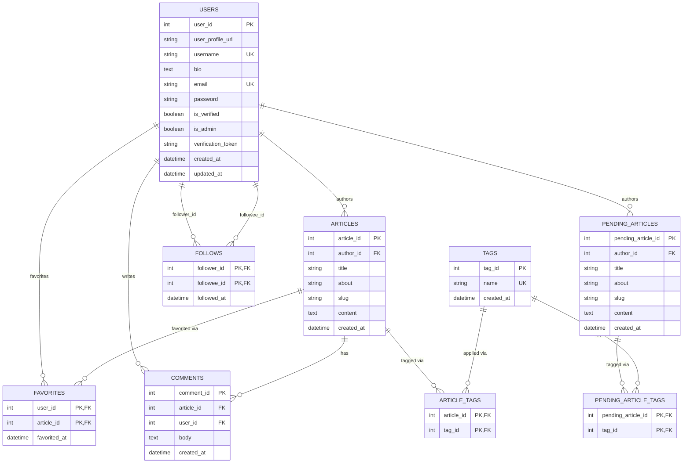

# Architecture

SulatTam is a small blogging platform: a React SPA talking over JSON to a
plain-PHP API, backed by MySQL. Everything below is traced to the source in
this repository — file paths are given so you can verify each claim yourself.

## System overview



- The React app (`frontend/`) is built with Vite and calls the API through a
  single `BASE_URL` constant (`frontend/src/utilities/dynamicDomain.tsx`),
  which resolves to `import.meta.env.VITE_API_URL` at build time, falling
  back to `http://localhost:8080` for a zero-config Docker Compose run.
- The API (`backend/`) is 28 standalone PHP scripts — one file per endpoint,
  no router or framework — plus three shared internals at `backend/` root
  (`db_connect.php`, `checkToken.php`, `allowedOrigins.php`) and two config
  files under `backend/config/`.
- MySQL is reached exclusively through `mysqli` with prepared statements;
  every query that includes user input goes through `->prepare()` /
  `->bind_param()` (verified while reading all 28 endpoint files — no raw
  string interpolation of request data into SQL was found).
- MailHog exists only because registration gates login behind an emailed
  verification link (see below); in production, `SMTP_HOST`/`SMTP_PORT`/
  `SMTP_USER`/`SMTP_PASS` point at a real mail provider instead.

## Auth flow

Auth is a JWT stored in an httpOnly cookie, issued after a mandatory email
verification step. Traced from `backend/auths/register.php`,
`backend/auths/verify.php`, `backend/auths/login.php`, and
`backend/checkToken.php`.



Key details, each traceable to a specific line:

- **Registration** (`auths/register.php`) hashes the password with
  `password_hash()`, generates `verificationToken = bin2hex(random_bytes(32))`,
  and inserts the row with `is_verified` defaulting to `0` (schema default).
  If an *unverified* row already exists with the same username/email, it is
  deleted first so the applicant can retry; a *verified* collision is
  rejected with 409. The verification link is built from
  `env('APP_URL', 'http://localhost:8080') . "/auths/verify.php?token=..."`.
- **Verification** (`auths/verify.php`) looks up the token, sets
  `is_verified = 1`, clears `verification_token`, and responds with a plain
  HTML page containing `alert(...); window.close();` — it does **not** return
  JSON, unlike every other endpoint in this codebase.
- **Login** (`auths/login.php`) is blocked with 403 if `is_verified` is falsy.
  On success it signs `{iss, iat, exp, user_id, username}` with HS256 using
  `$secretKey` from `config/config.php`, expiry `time() + (86400 * 7)` — a
  7-day token — and calls `setcookie('token', $jwt, [... 'httponly' => true,
  'secure' => $cookieSecure, 'samesite' => $cookieSameSite])`.
- **Protected endpoints** gate access one of two ways, both reading
  `$_COOKIE['token']` and decoding it with the same `$secretKey`:
  - `include '../checkToken.php'` — the shared gate — used by 6 endpoints:
    `gets/articles_by_tag.php`, `gets/articles_by_tag_count.php`,
    `gets/public_favorite_articles.php`, `gets/public_user_articles.php`,
    `gets/public_user_info.php`, `gets/public_view_article.php`.
  - An inline `try { JWT::decode(...) } catch` block — used by 14 endpoints
    that need `$decoded->user_id` in their own scope (the shared gate
    doesn't expose it back to the includer). See `API.md` for the exact
    list.
  - Both paths return **401** with `{"error": "Missing token"}` or
    `{"error": "Invalid or expired token"}` on failure, and `exit` before any
    query runs.
- **Logout** (`auths/logout.php`) does not check for a cookie at all — it
  unconditionally re-sets `token` to an empty string with the same flags and
  returns 200. Calling it while already logged out succeeds.
- `admin/admin.php` uses a **separate**, non-JWT auth mechanism: a native PHP
  session (`session_start()` / `$_SESSION['admin_logged_in']`) set after a
  same-page login form checks `users.email` + `password_verify()` **and**
  `is_admin = 1`. It never reads the `token` cookie.

## Data model

Nine tables, from `database/schema.sql`:



All foreign keys cascade on delete (and `articles.author_id` /
`pending_articles.author_id` also cascade on update). `favorites`,
`article_tags`, `follows`, and `pending_article_tags` are pure join tables
with composite primary keys — no surrogate id column.

### `pending_articles` / `pending_article_tags`

These two tables mirror `articles` / `article_tags` column-for-column, plus
`pending_article_id` in place of `article_id`. What the code actually does
with them, read from `backend/admin/admin.php`:

- `admin.php` (a session-gated HTML admin panel, `is_admin = 1` required —
  see the auth flow section) lists all rows in `pending_articles` joined to
  `users`, and offers **Approve** / **Reject** actions per row.
- **Approve**: copies the row into `articles`, copies its
  `pending_article_tags` rows into `article_tags` against the new
  `article_id`, then deletes both pending rows.
- **Reject**: deletes both pending rows, nothing is copied.

This confirms `pending_articles` is a moderation queue. However, reading
every write path in `backend/`: **no endpoint currently inserts into
`pending_articles`**. `posts/create_article.php` — the only article-creation
endpoint — writes straight into `articles` and `article_tags`, bypassing the
pending table entirely. So the approve/reject workflow in `admin.php` is
fully implemented against a table that nothing in the current codebase
populates. This is stated as observed fact, not inferred intent.

## Frontend state

Six context providers under `frontend/src/context/` hold all server-derived
state. Five of them (everything except `UserInfoProvider`) are composed by
`ArticleInfoProvider.tsx`, which is mounted once in `main.tsx` alongside
`UserInfoProvider`:

```
main.tsx
  └─ UserInfoProvider
       └─ ArticleInfoProvider
            └─ FavoriteArticlesProvider
                 └─ GlobalArticlesProvider
                      └─ FeedArticlesProvider
                           └─ CurrentUserArticlesProvider
                                └─ TagArticlesProvider
                                     └─ App
```

| Provider | Endpoints called | Components fed |
|---|---|---|
| `GlobalArticlesContext` | `GET gets/global_articles.php`, `GET gets/global_articles_count.php` | `components/GlobalArticleElements.tsx` renders the "Global" tab on `pages/Homepage.tsx`; `pages/NewArticle.tsx` and `pages/Settings.tsx` flip `refreshGlobalArticles` after a mutation to force a refetch |
| `FeedArticlesContext` | `GET gets/feed_articles.php`, `GET gets/feed_articles_count.php` | `components/FeedArticleElements.tsx` renders the "Your Feed" (followed authors) tab; `pages/ArticlePage.tsx` and `pages/PublicProfile.tsx` flip `refreshFeedArticles` after a follow/unfollow toggle |
| `TagArticlesContext` | `GET gets/popular_tags.php`, `GET gets/articles_by_tag.php`, `GET gets/articles_by_tag_count.php` | `components/TagArticleElements.tsx` and `pages/Homepage.tsx` (tag cloud + tag-filtered tab); depends on `GlobalArticlesContext`'s `refreshGlobalArticles` to refresh the tag list |
| `FavoriteArticlesContext` | `GET gets/favorite_articles.php`, `GET gets/favorite_articles_count.php` | `components/FavoriteArticleElements.tsx` (Profile's "Favorites" tab). Its `refreshAll` flag also doubles as the shared invalidation signal read by `GlobalArticlesContext`, `FeedArticlesContext`, and `CurrentUserArticlesContext`; it is flipped by `components/ArticleCard.tsx` (favorite toggle) and `pages/SignIn.tsx` (post-login refresh) |
| `CurrentUserArticlesContext` | `GET gets/current_user_articles.php`, `GET gets/current_user_articles_count.php` | `components/CurrentUserArticleElements.tsx` (Profile's "Your Articles" tab); `pages/NewArticle.tsx` and `pages/Settings.tsx` flip `refreshCurrentUserArticles` after a mutation |
| `UserInfoProvider` | `GET gets/current_user_info.php` | Route guards `components/RequireAuth.tsx`, `RedirectIfAuth.tsx`, `RedirectIfInvalid.tsx` (via `isTokenMissing`/`isLogin`); `components/Navbar.tsx`, `ArticleCard.tsx`, `CommentSection.tsx`; pages `Profile.tsx`, `Settings.tsx`, `SignIn.tsx`, `ArticlePage.tsx`, `Homepage.tsx` |

`UserInfoProvider` also caches the last-known user object in
`localStorage['user']` so the UI can render optimistically before
`current_user_info.php` resolves; a failed fetch clears it, sets
`isTokenMissing = true`, and navigates to `/login`.

## Request lifecycle

Every one of the 28 endpoint files repeats the same shape (no shared
router — this is 28 independent PHP entry points):

1. **CORS preflight.** `include '../allowedOrigins.php'` loads
   `$allowedOrigins` from `ALLOWED_ORIGINS` (comma-separated env var,
   default `http://localhost:5173`). The script reads
   `$_SERVER['HTTP_ORIGIN']`; if it's in the allow-list, it sets
   `Access-Control-Allow-Origin: $origin` and
   `Access-Control-Allow-Credentials: true`. If the request method is
   `OPTIONS`, the script returns `200` immediately with
   `Access-Control-Max-Age: 86400` and exits — no further code runs.
2. **Credentialed fetch.** The frontend calls the API with axios and
   `withCredentials: true` (27 call sites across `frontend/src`, e.g.
   `frontend/src/pages/SignIn.tsx:49`), so the browser attaches the `token`
   cookie automatically on same-site requests.
3. **Method check.** Each script checks `$_SERVER['REQUEST_METHOD']`
   explicitly and returns `405 {"error": "Invalid request method"}` for
   anything unexpected.
4. **`checkToken.php` gate (protected endpoints only).** See the auth flow
   section above — either the shared include or an inline
   `JWT::decode()`/`catch` block. Returns `401` and exits on failure before
   touching the database.
5. **Prepared-statement query.** `include '../db_connect.php'` opens a
   `mysqli` connection built from `DB_HOST`/`DB_USER`/`DB_PASS`/`DB_NAME`
   (env-driven, defaults to `localhost`/`root`/``/`sulat_tam`). Every query
   carrying user input uses `$conn->prepare(...)` + `->bind_param(...)`.
6. **JSON response.** `http_response_code(...)` is set before
   `echo json_encode([...])`. The shared error shape across all 28 endpoints
   is `{"error": "..."}`. (The one exception is `auths/verify.php`, which
   returns an HTML/JS page instead of JSON, since it's meant to be opened
   directly from an email link, not called via fetch.)

## Configuration

Two files under `backend/config/` are the single source of runtime
configuration, replacing what were previously per-file hardcoded values:

- **`config/env.php`** is a ~50-line dependency-free `.env` parser
  (`sulattam_load_env()`), deliberately not a Composer package — Composer is
  already a dependency for `firebase/php-jwt` and PHPMailer, but a full
  dotenv library for this little parsing would be disproportionate. It reads
  `KEY=value` lines, strips one matched pair of surrounding quotes, and —
  critically — **never overwrites a variable the real environment already
  provides** (`getenv($key) === false` guard). This means a container can
  set config purely through `environment:` entries with no `.env` file
  present at all, which is how `docker-compose.yml` runs the `api` service.
  `env(string $key, ?string $default)` is the accessor every other file
  calls.
- **`config/config.php`** is the single source of the JWT signing key and
  cookie flags, replacing what the file's own comment describes as "sixteen
  copy-pasted `$secretKey = "..."` assignments." It calls
  `sulattam_load_env()` itself, then reads `JWT_SECRET` — if unset or empty,
  the server **fails closed**: `500 {"error": "Server misconfigured: ..."}`
  and `exit`, rather than falling back to a guessable default. It also
  derives `$cookieSecure` (bool, default `true`) and `$cookieSameSite`
  (default `'None'`) from `COOKIE_SECURE` / `COOKIE_SAMESITE`.
- **Why the cookie flags are environment-driven:** the production defaults
  (`Secure=true`, `SameSite=None`) are required for a cross-site cookie over
  HTTPS. Local Docker Compose serves the frontend on `localhost:5173` and the
  API on `localhost:8080` over plain HTTP — different ports, same site.
  Chrome and Firefox both treat `http://localhost` as a potentially
  trustworthy origin, so a `Secure` cookie is actually expected to work there
  too — but the failure mode if that assumption is ever wrong is severe and
  confusing (login returns HTTP 200 with a valid payload, the browser
  silently discards the cookie, and every later request 401s), so the flags
  are overridden anyway rather than betting on browser behaviour.
  `docker-compose.yml` sets `COOKIE_SECURE: "false"` and
  `COOKIE_SAMESITE: Lax` so the cookie survives in that environment
  regardless, while a real deployment leaves the production defaults in
  place.
- **`APP_URL`** (also env-driven, default `http://localhost:8080`) supplies
  the base URL `auths/register.php` embeds in the verification email link —
  it must point at the API host, since `verify.php` is a backend endpoint,
  not a frontend route.

- **`IMGBB_API_KEY`** backs profile-picture uploads. `updates/user_info.php`
  posts the image to the ImgBB API and stores the returned URL on the user
  row. The key is read through `env()` like every other secret, and the
  upload path **degrades gracefully** when it is unset: `uploadToImgBB()`
  returns `null`, the caller's `if ($uploadedUrl)` guard skips the
  assignment, and the profile saves without a new picture rather than
  erroring. That makes the variable optional — the app runs fine without an
  ImgBB account.
